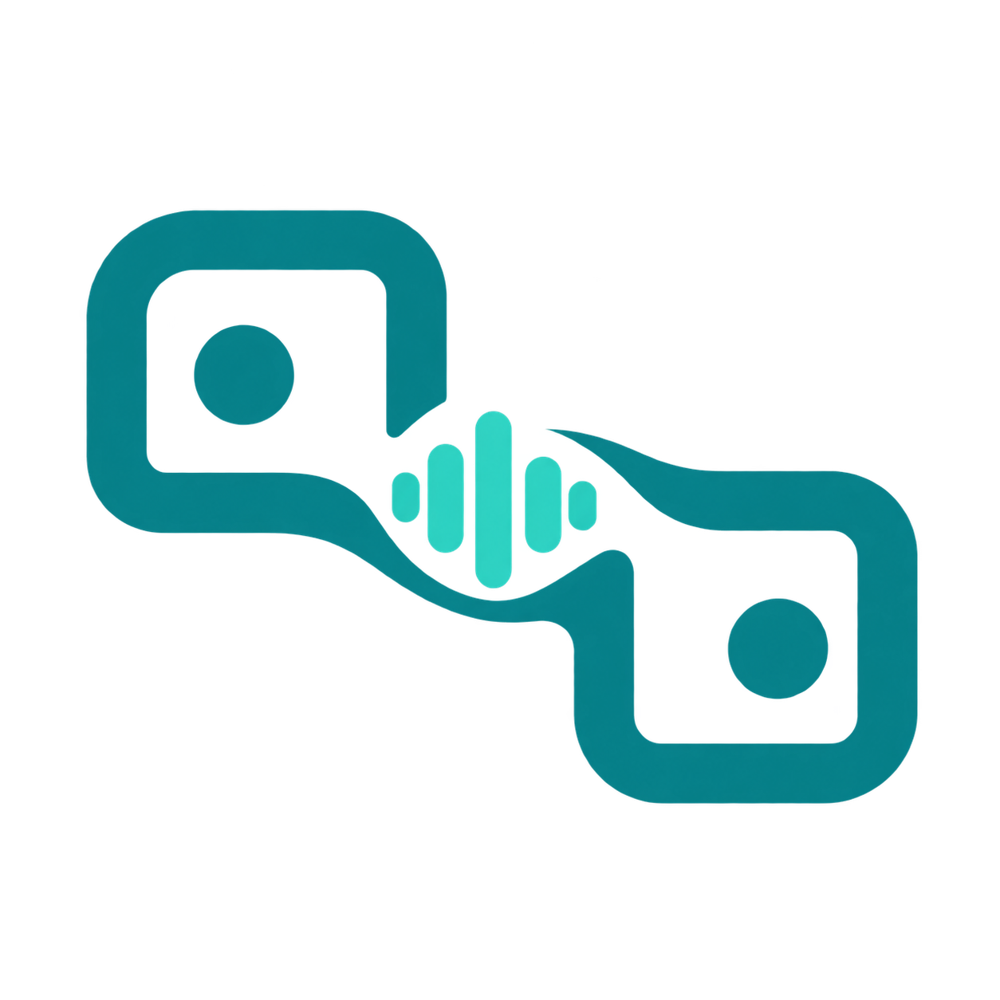

# Sonos Follow Me – deutsche Anleitung

<p></p>

Musik folgt dir durch mehrere Räume. Jeder Raum bekommt einen Sonos-Lautsprecher, mindestens zwei Sensoren, eigene Musikquellen und Zeitwerte. Die Einrichtung erfolgt vollständig in Home Assistant; zusätzliche `input_boolean`- oder `input_number`-Helfer sind nicht nötig.

## Installation

Voraussetzung: **Home Assistant 2026.9.0 oder neuer**, eingerichtete offizielle **Sonos-Integration** und mindestens zwei binäre Sensoren pro Raum.

1. In **HACS → Benutzerdefinierte Repositories** `https://github.com/mvs90/sonos-follow-me` als **Integration** hinzufügen.
2. **Sonos Follow Me** herunterladen und Home Assistant neu starten.
3. **Einstellungen → Geräte & Dienste → Integration hinzufügen → Sonos Follow Me** öffnen.
4. Raumname, Lautsprecher, primären Sensor, weitere Sensoren und Musikquellen auswählen.
5. Für jeden weiteren Raum erneut einen Eintrag hinzufügen. Einstellungen später über **Konfigurieren** ändern.

Das Repository ist über HACS als benutzerdefiniertes Repository installierbar. Es ist **nicht im HACS-Standardkatalog gelistet**. Die alte Blueprint-Automation für dieselben Lautsprecher deaktivieren, damit sie nicht gleichzeitig eingreift.

## Eigene Dashboard-Karte (ab v0.3.0)


*Vorschau mit simulierten Raumdaten.*

Die Karte wird im selben HACS-Paket mitgeliefert und automatisch geladen. Ab v0.3.1 zeigt sie das eigene Projektlogo im Kopfbereich; das Bild wird lokal mit der Integration ausgeliefert. Kein zweites HACS-Repository und keine manuelle Ressource sind nötig.

1. In HACS aktualisieren und Home Assistant neu starten.
2. Den Browser bzw. die Companion-App vollständig neu laden.
3. Dashboard bearbeiten → **Karte hinzufügen → Sonos Follow Me**.

Alternativ eine manuelle Karte anlegen:

```yaml
type: custom:sonos-follow-me-card
title: Sonos Follow Me
```

Ohne weitere Angaben erscheinen alle eingerichteten Räume. Im grafischen Karteneditor lassen sich Titel und einzelne Räume auswählen. Alternativ unter `entities` die Follow-Me-Schalter angeben (die tatsächlichen Entitäts-IDs aus deiner Installation verwenden):

```yaml
type: custom:sonos-follow-me-card
title: Musik im Haus
entities:
  - switch.badezimmer_follow_me
  - switch.arbeitszimmer_follow_me
```

Die Karte zeigt Belegung, Lautsprecher, gespeicherte Lautstärke, Sensorzustände, Quellenpriorität und eine laufende Abkühlzeit. Die Anzeige der verbleibenden Zeit aktualisiert sich etwa alle 30 Sekunden. **Follow Me**, **Standardlautstärke verwenden**, **Standardlautstärke in Prozent**, **Abkühlzeit**, **Ausschaltverzögerung**, **Überblenddauer** und **Sensorlogik** sind direkt bedienbar. Weitere Einstellungen sind pro Raum aufklappbar.

Die Bedienelemente sind normale Home-Assistant-Schalter, Zahlen- und Auswahlentitäten. Sie können auch in Standardkarten oder Automationen verwendet werden und unterliegen den normalen Entitätsberechtigungen. Änderungen bleiben gespeichert und laden die Raumsteuerung nicht neu; laufende Wiedergabekontrolle bleibt erhalten. Raumname sowie Sensor-, Lautsprecher- und Quellenzuordnung werden weiterhin unter **Konfigurieren** geändert; solche Änderungen laden den Raum neu.

Falls die Karte nach einem Update fehlt, zuerst Browser-/App-Cache neu laden. Als manueller Fallback kann unter Dashboard-Ressourcen `/sonos_follow_me/sonos-follow-me-card.js?v=0.3.1` als **JavaScript-Modul** eingetragen werden. Die Integration muss eingerichtet und geladen sein. Deaktivierte oder ausgeblendete Entitäten ggf. wieder aktivieren. Ein deaktivierter Raum-Eintrag ist keine steuerbare Karte.

## Sensorlogik

**Primär startet, weitere halten:** Der PIR muss zuerst Anwesenheit erkennen. Danach dürfen Radar und beliebig viele weitere Sensoren die Belegung halten. Ein Radar-Fehlalarm alleine startet keine Musik. Meldet ein Sensor bereits beim PIR-Ereignis Anwesenheit, hält er den Raum ebenfalls.

Beispiel Toilette: Der PIR erkennt das Betreten. Die Person sitzt still, der PIR meldet wieder „frei“, aber der Radar erkennt sie weiterhin. Die Musik bleibt an. Erst wenn **alle** Sensoren während der gesamten Ausschaltverzögerung „frei“ melden, endet die Belegung. Ein späterer Radar-Fehlalarm darf nicht neu starten.

**Alle Sensoren gleichberechtigt:** Jeder Sensor darf Anwesenheit starten und halten. Frei wird der Raum auch hier erst, wenn alle Sensoren durchgehend aus sind.

Nicht verfügbare oder unbekannte Sensoren gelten nicht als „frei“. Neue Anwesenheit während der Verzögerung oder beim Ausblenden bricht das Verlassen ab.

## Einstellungen und Bedienung

- **Ein Lautsprecher je Raum:** weitere Räume als weitere Einträge anlegen. Ein Sonos-Stereopaar kann als einzelne Sonos-Entität ausgewählt werden.
- **Mindestens zwei Sensoren:** ein primärer und mindestens ein weiterer; zusätzliche Sensoren sind möglich.
- **Musikquellen:** andere Sonos-Lautsprecher auswählen. Die erste spielende Quelle in der Auswahlreihenfolge gewinnt; es wird genau einer Gruppe beigetreten.
- **Ausschaltverzögerung:** 0–3600 Sekunden, Standard 15.
- **Überblenddauer:** 0–30 Sekunden, Standard 3. Mit 0 werden Überblendungen deaktiviert.
- **Anfangslautstärke:** 0–1, Standard 0,3. Danach wird die im normalen Betrieb geänderte Lautstärke gespeichert.
- Pro Raum entstehen ein **Follow-Me-Schalter** und ein **Belegungssensor**. Mehrere Schalter können gemeinsam über Dashboard oder Automation bedient werden.

## Optionale Standardlautstärke mit Abkühlzeit

Unter **Konfigurieren** gibt es drei neue Einstellungen:

- **Standardlautstärke nach Abwesenheit verwenden:** aktiviert die Funktion. Bei bestehenden und neuen Räumen zunächst ausgeschaltet.
- **Standardlautstärke (0–1):** beispielsweise 0,25 für 25 %.
- **Abkühlzeit:** in Minuten, beispielsweise 30. Mit **0** gilt die Standardlautstärke sofort für den nächsten Besuch, nachdem der Raum als frei erkannt wurde.

Die Zeit beginnt, sobald der Raum **nach der Ausschaltverzögerung** frei ist. Beispiel: letzte Lautstärke 60 %, Standard 25 %, Abkühlzeit 30 Minuten. Bei Rückkehr nach 10 Minuten wird wieder auf 60 % eingeblendet. Die alte Abkühlzeit wird verworfen; beim nächsten Verlassen starten erneut volle 30 Minuten. Bei Rückkehr nach mindestens 30 Minuten wird auf 25 % eingeblendet.

Die Funktion ändert die Ziel-Lautstärke beim nächsten Betreten. Während der Abwesenheit wird kein zusätzlicher Lautstärkebefehl gesendet; laufende Musik wird durch den Ablauf nicht verändert. Ein Radar-Fehlalarm alleine setzt die Abkühlzeit im PIR-Modus nicht zurück. Gültige Anwesenheit setzt sie auch dann zurück, wenn gerade keine Musikquelle spielt.

Eine begonnene Abkühlzeit übersteht Neustarts und Neuladen; die Zeit während des Neustarts zählt mit. Eine Änderung der Abkühlzeit verwendet die neue Dauer ab dem gespeicherten Zeitpunkt des Freiwerdens. Das Ausschalten von Follow Me startet selbst keine Abkühlzeit; ein vorhandener Zeitpunkt bleibt gespeichert. Die unten beschriebenen Grenzen der Wiedergabekontrolle nach Neustarts gelten weiterhin.

## Verhalten und Grenzen

Musik zunächst auf einer Quelle starten. Die Integration wählt keine Playlists und startet keine stumme Quelle. Sie übernimmt nur Lautsprecher, die sie selbst einer spielenden Gruppe hinzugefügt hat; bereits manuell laufende Musik und vorhandene Gruppen werden nicht übernommen. Beim Verlassen blendet sie aus, trennt den verwalteten Lautsprecher ab, pausiert ihn und stellt die gespeicherte Lautstärke wieder her. Wird er zwischenzeitlich Gruppenkoordinator für andere Lautsprecher, gibt die Integration die Kontrolle ab, statt die Gruppe zu zerlegen.

Ausschalten des Follow-Me-Schalters lässt die aktuelle Wiedergabe bestehen. Lautstärke und Schalterzustand bleiben über Neustarts erhalten. Belegung und Wiedergabekontrolle werden beim Neustart oder Neuladen zurückgesetzt. Änderungen der öffentlichen Einstellungen laden den Raum ab v0.3.0 nicht mehr neu. Eine zuvor verbundene Wiedergabe wird dann nicht automatisch gestoppt; den Raum einmal manuell abtrennen/pausieren, um ihn beim nächsten Betreten wieder automatisch übernehmen zu lassen.

Lautstärkeänderungen **während einer Überblendung** werden nicht gespeichert und können überschrieben werden. Für unmittelbare manuelle Kontrolle die Überblenddauer auf 0 setzen. Netzwerkfehler können Sonos-Aktionen verhindern; Fehler stehen im Home-Assistant-Protokoll. Ein späteres Zustandsereignis kann einen neuen Beitrittsversuch auslösen.

Softwaretests laufen gegen **Home Assistant 2026.9.4**. Ein Praxistest mit echten Sonos-Geräten steht noch aus. Veröffentlichung und Installation konfigurieren deine laufende Home-Assistant-Instanz nicht automatisch.

MIT-Lizenz, unabhängiges Community-Projekt. Weitere technische Hinweise und Entwicklungsbefehle stehen in der [englischen README](README.md).
