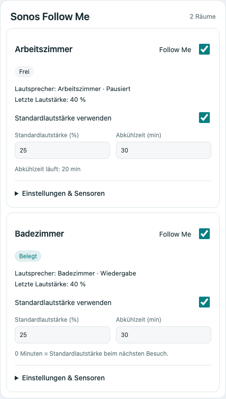

# Sonos Follow Me

Follow music between rooms using PIR and radar presence sensors. A Home Assistant custom integration, installable through HACS as a custom repository. MIT licensed; independent community project, not affiliated with Sonos.

**[Deutsche Anleitung](README.de.md)**

## Features

- Any number of rooms, each with its own Sonos speaker, two or more sensors, source priorities and timing.
- **Primary mode:** PIR starts occupancy. Radar and any additional sensors only hold occupancy after the PIR has detected someone. Radar alone cannot start music.
- **Equal mode:** any configured sensor can start or maintain occupancy.
- Departure only after **all** sensors remain `off` throughout the configured delay. Renewed presence cancels departure, including during fading.
- Optional default volume after an absence cooldown (including immediate reset for the next visit).
- Room enable switch and occupancy entity. Smooth configurable fades; remembered volume and enable state, without external helpers.
- UI setup and options in English and German. Uses the official Sonos integration locally.

## Installation

Requires Home Assistant **2026.9.0+**, the official **Sonos** integration, and at least two binary sensors per room. Tested in software against HA 2026.9.4; physical Sonos hardware validation is still outstanding.

1. In HACS, open **Custom repositories**, add `https://github.com/mvs90/sonos-follow-me`, category **Integration**.
2. Download **Sonos Follow Me** and restart Home Assistant.
3. Go to **Settings → Devices & services → Add integration → Sonos Follow Me**.
4. Add one entry per room. Repeat to manage additional speakers/rooms.

This is a custom repository, **not an entry in the default HACS catalog**. Default listing and Home Assistant Brands inclusion have not been requested.

Manual installation: copy `custom_components/sonos_follow_me` to your HA `config/custom_components` directory and restart.

## Bundled dashboard card (v0.3.0+)



*Preview with simulated room data.*

The integration ships and automatically loads **Sonos Follow Me**, a custom dashboard card. Update in HACS, restart Home Assistant, then fully reload the browser/app. Choose **Edit dashboard → Add card → Sonos Follow Me**. No separate frontend repository or resource registration is required.

```yaml
type: custom:sonos-follow-me-card
title: Sonos Follow Me
```

All rooms are discovered automatically. The graphical editor supports a custom title and selection of specific rooms. Optional YAML `entities` accepts a list of your room's **Follow Me switch entity IDs**; an omitted or empty list shows all rooms.

The card shows occupancy, speakers, remembered volume, cooldown status (updated approximately every 30 seconds), sensor states and source priority. Control Follow Me, volume reset, default volume **in percent**, cooldown, clear delay, fade duration and sensor mode directly. Additional settings/sensor details expand per room. It supports English/German, mobile layouts, theme colors and visible service errors.

Controls use standard Home Assistant `switch`, `number` and `select` entities and normal entity permissions, so they also work in other cards and automations. Public settings persist through config-entry options and apply live without losing playback ownership. Device/sensor/source assignments and room names remain in the integration's Configure dialog; changing those still reloads the room.

If the card is missing, reload the frontend cache first. A manual fallback resource is `/sonos_follow_me/sonos-follow-me-card.js?v=0.3.0`, type **JavaScript module**. The integration must be configured and loaded. Disabled entities need enabling if their controls are desired.

Frontend development: `npm ci`, `npx playwright install chromium`, `npm test`. Browser tests use simulated Home Assistant states and services; they do not connect to real speakers.

## Room settings

| Setting | Meaning |
| --- | --- |
| Name | Name of the virtual room device |
| Sonos speaker | One destination speaker per room; cannot be assigned twice |
| Primary sensor | Reliable PIR / movement sensor |
| Additional sensors | One or more distinct presence sensors, e.g. radar |
| Sources | Other Sonos players; the first playing source in the selected order wins |
| Sensor mode | `primary` (PIR starts, others hold) or `equal` |
| Clear delay | 0–3600 seconds; default 15 |
| Fade duration | 0–30 seconds per fade; default 3; 0 disables fading |
| Initial volume | 0–1; default 0.3; afterwards the remembered volume is used |
| Reset volume after absence | Optional, disabled by default (including existing rooms) |
| Default volume | Next visit’s target after cooldown, 0–1; default 0.3 |
| Volume cooldown | 0–10080 minutes; default 30; 0 means the next visit uses the default immediately |

Edit a room through its integration **Configure** button. Switch entities allow a dashboard toggle or a separate automation to enable/disable several rooms together.

### Optional volume cooldown

Enable **Reset volume after absence**, choose a **Default volume**, and set **Volume cooldown** (for example 30 minutes). The cooldown starts when the room becomes vacant **after the clear delay**. It does not change the speaker volume while the room is empty or interrupt ongoing playback.

Example: last volume 60%, default 25%, cooldown 30 minutes. Return after 10 minutes and music fades to 60%. That return cancels the old cooldown; the next departure starts a fresh 30 minutes. Return after 30 minutes or longer and music fades to 25%. With 0 minutes, each new visit after the room has cleared uses 25%.

Only valid occupancy counts: radar alone in primary mode cannot cancel the cooldown. A valid return resets it even if no music source is playing. An already-started cooldown survives a restart/reload, including time offline. Changing the cooldown setting applies the new duration to the saved vacancy time. Disabling Follow Me does not itself start a cooldown; existing cooldown timestamps remain saved. The existing restart/playback ownership behavior below still applies.

### Bathroom example

1. Radar falsely reports presence while PIR is off → nothing happens in primary mode.
2. Someone enters and PIR turns on → the speaker joins the first playing source.
3. The person sits still; PIR turns off, radar stays on → music continues.
4. Both sensors turn off → the clear delay starts.
5. A sensor turns on during that delay → the delay is cancelled.
6. All sensors stay off → fade out, unjoin, pause the detached speaker, restore its remembered volume.
7. A later radar-only detection cannot reactivate the room until PIR detects presence again.

An `unknown`, `unavailable` or missing sensor does **not** count as clear; it holds an already occupied room. Fix an unavailable sensor or disable the room if necessary.

## Playback behavior and limitations

- Start music on a source yourself. The integration copies an existing playing group; it does not select playlists or start a silent source. If a source starts while the room is occupied, its state change triggers joining.
- Each entry controls one Sonos media-player entity. Configure more entries for more rooms/speakers. A Sonos stereo pair exposed as one entity also works through the Sonos integration.
- Only speakers joined by this controller are automatically detached/paused. Already playing destinations, existing group members, and manually started source playback are not taken over. If a managed destination becomes coordinator for other speakers, automatic departure relinquishes control to avoid dismantling that group.
- Disabling a room stops its automation and leaves playback in place. It does not pause the group. Sensor evaluation restarts on enable; radar alone cannot re-arm primary mode.
- Volume changes during ordinary playback are remembered. Changes **during a fade** are not treated as a new target and may be overwritten; set fade duration to zero if immediate manual volume control is preferred.
- Volume and enable state persist across restarts. Occupancy and playback ownership deliberately reset on restart/reload. Previously joined playback is left untouched; detach/pause that destination manually once if you want automatic ownership on the next visit.
- Failed Sonos actions are logged. A later state event can retry joining; there is no continuous retry loop. Network outages can prevent cleanup or volume restoration.
- Disable your old Follow Me blueprint automations for these same speakers to prevent conflicting actions. No changes to your Home Assistant instance are made by publishing/installing the repository alone.

## Development

Python 3.14 and Home Assistant 2026.9.4:

```sh
python -m venv .venv
.venv/bin/pip install -r requirements-test.txt
.venv/bin/pytest -q
.venv/bin/ruff check custom_components tests
.venv/bin/ruff format --check custom_components tests
```

Tests cover the presence latch, UI validation, timer cancellation, source selection, playback ownership, service failures and interrupted departure. GitHub Actions runs these tests plus Hassfest and HACS validation (Brands check excluded while this remains a custom repository).

Based on the user-provided `Multiroom Sonos Follow Me (Universal)` automation, reimplemented as an event-driven integration. Bug reports and pull requests are welcome; include HA version, mode and a sanitized sequence of sensor states.

See [Home Assistant Sonos documentation](https://www.home-assistant.io/integrations/sonos/) and [HACS integration requirements](https://www.hacs.dev/docs/publish/integration/).
